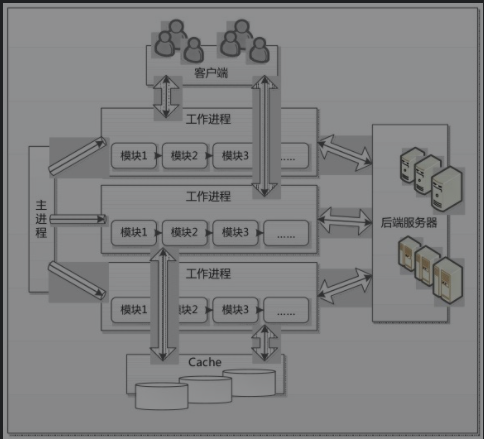

### Nginx 服务器的 Web 请求处理机制

Web 服务器和客户端是一对多的关系，一般完成并行处理请求的工作有三种方式：

1. 多进程方式

   - 概念：服务器每当接收到一个客户端请求时，就由服务器主进程**生成一个子进程**和该客户端连接进行交互，直至断开；
   - 优点：设计实现简单，子进程相互独立，当某个子进程出现问题不会影响其他进程，保证稳定；当子进程退出，其占用资源会被操作系统回收，也不会留下垃圾；
   - 缺点：操作系统生成一个子进程需要进行内存复制等操作，在资源和时间上会产生一定的额外开销，不适用于处理大量并发请求；

2. 多线程方式

   - 概念： 服务器每当接收到一个客户端请求时，会由服务器主进程**派生一个线程**出来和该客户端进行交互；
   - 优点：减轻 Web 服务器对系统资源的要求；
   - 缺点：多个线程位于同一个进程，可以访问同样的内存空间，彼此之间相互影响；

3. 异步方式

   通讯模式：同步、异步；

   进程处理调用方式：阻塞、非阻塞；

   - 同步阻塞：发送方向接收方发送请求后，（发送方）一直等待响应，请求方一直等待结果；
   - 同步非阻塞：发送方向接收方发送请求后，（发送方）一直等待响应，请求方进行 IO 操作如果没能马上收到结果，立即返回；
   - 异步阻塞：发送方向接收方发送请求后，（发送方）不用等待响应，请求方如果没能马上得到结果，就一直等待；
   - 异步非阻塞：发送方向接收方发送请求后，（发送方）不用等待响应，请求方如果没能马上得到结果，不等待，知道有结果之后再返回给发送方；

   Nginx 异步机制采用的是异步非阻塞；

Nginx 服务架构示意图

#### Nginx 服务器的进程

- 主进程（Master Process）

  作用：与外界通信和对内部的其他进程进行管理；

  - 读取 Nginx 配置文件并验证有效性和正确性；
  - 建立、绑定、关闭 socket；
  - 按照配置生成、管理和结束工作进程；
  - 接收外界指令，eg：重启、升级、退出等
  - 不中断服务，实现平滑重启，应用新配置；平滑升级，升级失败进行回滚处理
  - 开启日志文件，获取文件描述符；
  - 编译和处理 Perl 脚本；

- 工作进程 （Worker Process）

  由主进程生成，生成数量可以通过 Nginx 配置文件指定，正常情况下生存于主进程整个生命周期。

  - 接收客户端请求；
  - 将请求一次送入各个功能模块进行过滤处理；
  - IO 调用，获取响应数据；
  - 与后端服务器通信，接收后端服务器处理结果；
  - 数据缓存，访问缓存索引、查询、调用缓存数据；
  - 发送请求结果，响应客户端请求；
  - 接收主程序指令，比如重启、升级、退出指令；
