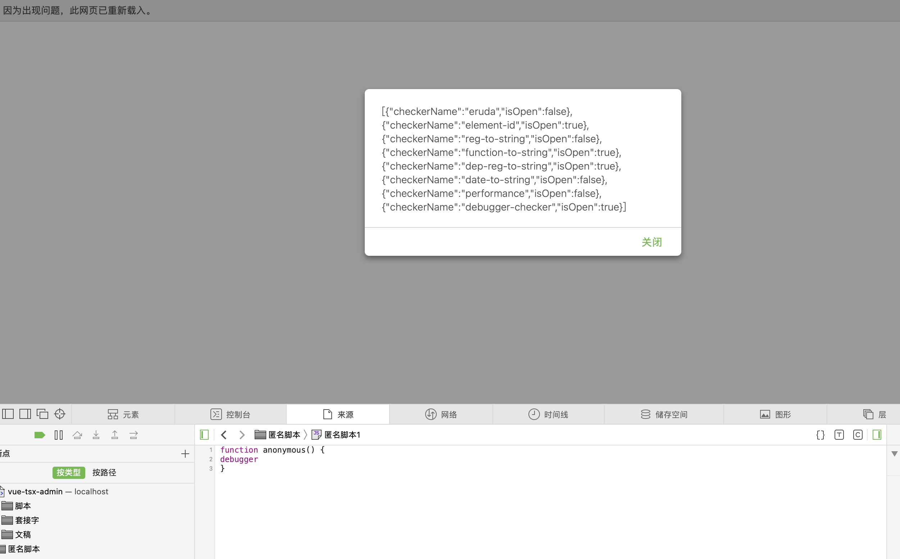
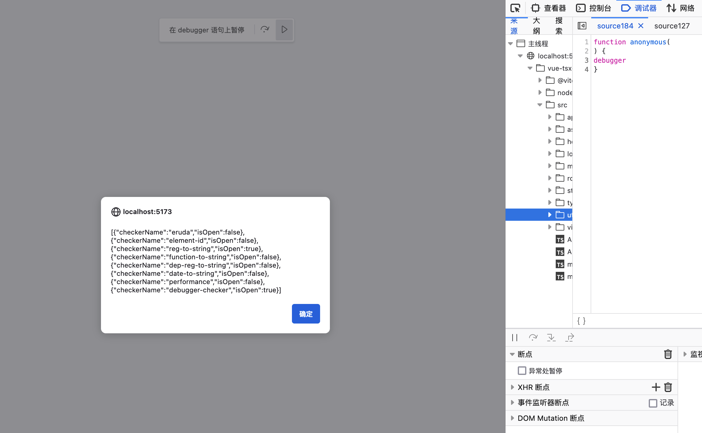
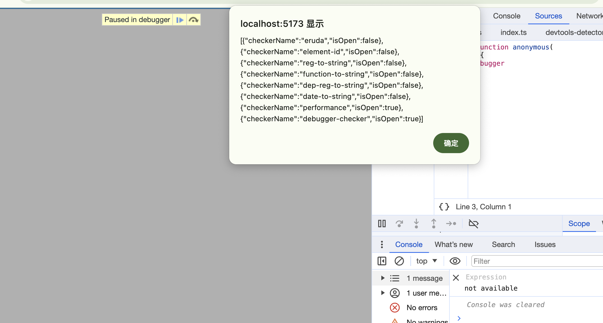

## 禁止打开调试窗口

### 场景

一般在开发过程中，有些需求处于安全性考虑，不希望用户打开调试窗口，或者是采用一些规避手段禁止用户打开调试窗口，本文将介绍一些规避手段。

### 常见的解决方案

#### 方案一： 通过监听键盘事件禁止打开调试窗口

```js
// 判断是否打开了控制台
const isDevToolsOpen = () => {
  console.log('检测到控制台被打开');
  // 这里可以执行一些操作来干扰调试，例如重定向页面
  window.location = 'about:blank';
};

document.addEventListener('keydown', function (e) {
  e.preventDefault();
  // 禁止F12打开控制台
  if (e.keyCode === 123) {
    isDevToolsOpen();
    return false;
    // 禁止Ctrl+Shift+I打开控制台
  } else if (e.ctrlKey && e.shiftKey && e.keyCode === 73) {
    isDevToolsOpen();
    return false;
    // 禁止Ctrl + Shift + J 打开控制台
  } else if (e.ctrlKey && e.shiftKey && e.keyCode === 74) {
    isDevToolsOpen();
    return false;
  }
});
```

方案弊端：

- 无法禁止右键打开控制台
- 无法禁止通过菜单栏打开控制台
- 无法禁止修改快捷键打开控制台

#### 方案二： 采用调试窗口占据屏幕的位置判断

通过判断 `window.outerWidth - window.innerWidth` 的值是否小于等于 160 来判断是否打开了控制台

```js
function isDevToolsOpen() {
  const threshold = 160;
  // 外框与内框的宽度差或高度差超过阈值时，开发者工具可能被打开
  return (
    window.outerWidth - window.innerWidth > threshold ||
    window.outerHeight - window.innerHeight > threshold
  );
}

setInterval(() => {
  if (isDevToolsOpen()) {
    alert('开发者工具被检测到已打开，请关闭后继续！');
    // 这里可以执行一些操作来干扰调试，例如重定向页面
    window.location = 'about:blank';
  }
}, 1000);
```

方案弊端：

- 可通过“undock into separate window” 将开发者工具从当前的窗口中分离出来，使其在一个新的独立窗口中打开

<br/>

> 上述的两种方案都是防小小白，实际开发中这种方式不可取，因为解决不了实际问题，还暴漏了技术水平。。。

<br/>

### 大牛的解决方案

参见 GitHub 上的 [devtools-detector](https://github.com/AEPKILL/devtools-detector)

扒了下源码，大致思路如下：

- 首先准备了几个 `checker`
  ```js
  const defaultDetector = new DevtoolsDetector({
    // 会按照 checker 的顺序执行检查
    checkers: [
      checkers.erudaChecker,
      checkers.elementIdChecker,
      checkers.regToStringChecker,
      checkers.functionToStringChecker,
      checkers.depRegToStringChecker,
      checkers.dateToStringChecker,
      checkers.performanceChecker,
      checkers.debuggerChecker
    ]
  });
  ```
- 对`checker` 进行定时轮询，一真为真，全假即假，每个`checker`有自己特定的应用场景（处理兼容性问题），在每个`checker`中会有体现，例如在`regToStringChecker`中，会通过正则表达式匹配`toString`方法中：

  ```ts
  import { DevtoolsStatusChecker } from '../types/devtools-status-checker.type';
  import { clear, log } from '../shared/console';
  import { isWebkit } from '../shared/context';
  import { match } from '../shared/utils';

  const reg = / /;
  let isOpen = false;

  reg.toString = () => {
    isOpen = true;
    return regToStringChecker.name;
  };

  export const regToStringChecker: DevtoolsStatusChecker = {
    name: 'reg-to-string',
    async isOpen(): Promise<boolean> {
      isOpen = false;

      log(reg);
      clear();

      return isOpen;
    },
    async isEnable(): Promise<boolean> {
      return match({
        /** 匹配所有浏览器 */
        includes: [true],
        /** 排除 webkit */
        excludes: [isWebkit]
      });
    }
  };
  ```

对于这些`checker`, 可以将其分为 4 类：

1.  通过对象下的`toString`方法来判断是否打开了控制台，例如`regToStringChecker`、`functionToStringChecker`、`depRegToStringChecker`、`dateToStringChecker`等；

    这种处理方式的原理是，如果打开了控制台通过`console.log`将其打印，那么在部分浏览器器中会隐式调用对象的`toString`方法；但是并不是所有浏览器都会隐式调用`toString`方法，例如`chrome`浏览器，所以这种方式并不是很稳定，但是可以用来处理兼容性问题；

2.  通过执行脚本的时差来判断，例如`performanceChecker`、`debuggerChecker`等；

    附上`debugger`的处理方案：

    ```ts
    import { now } from '../shared/utils';
    import type { DevtoolsStatusChecker } from '../types/devtools-status-checker.type';

    export const debuggerChecker: DevtoolsStatusChecker = {
      name: 'debugger-checker',
      async isOpen(): Promise<boolean> {
        const startTime = now();

        // tslint:disable-next-line:no-empty only-arrow-functions
        (function () {}).constructor('debugger')();

        return now() - startTime > 100;
      },
      async isEnable(): Promise<boolean> {
        return true;
      }
    };
    ```

    这两种的方案都是利用了如果控制台打开了，那么对应的脚本会执行，只是一个是利用的 `debugger`，一个是利用了`console`

3.  通过`getter`的方式处理，例如`elementIdChecker`；

    ```ts
    import { isEdge, isIE, isFirefox, createElement } from '../shared/context';
    import { clear, log } from '../shared/console';
    import type { DevtoolsStatusChecker } from '../types/devtools-status-checker.type';
    import { match } from '../shared/utils';

    const ele = createElement('div');
    let isOpen = false;

    Object.defineProperty(ele, 'id', {
      get() {
        console.log('get');
        isOpen = true;
        return elementIdChecker.name;
      },
      configurable: true
    });

    export const elementIdChecker: DevtoolsStatusChecker = {
      name: 'element-id',
      async isOpen(): Promise<boolean> {
        isOpen = false;

        log(ele);
        clear();

        return isOpen;
      },
      async isEnable(): Promise<boolean> {
        return match({
          /** 匹配所有浏览器 */
          includes: [true],
          excludes: [isIE, isEdge, isFirefox]
        });
      }
    };
    ```

    这种方式是利用了`getter`的特性，如果打开了控制台，那么会调用`getter`，从而触发`console.log`，从而打印出`get`，这种方式也是利用了控制台打开了，会执行脚本的特性；

4.  通过`window`对象的属性来判断，例如`erudaChecker`；(ps: 这块没看懂)

### 测试

> 经过实践测试了下，对于各个浏览器的表现：

Safari 浏览器：

| checkerName | isOpen |
| ------------------- | ------ |
| eruda | false |
| element-id | true |
| reg-to-string | false |
| function-to-string | true |
| dep-reg-to-string | true |
| date-to-string | false |
| performance | false |
| debugger-checker | true |

Firefox 浏览器：

| checkerName | isOpen |
| ------------------- | ------ |
| eruda | false |
| element-id | false |
| reg-to-string | true |
| function-to-string | false |
| dep-reg-to-string | false |
| date-to-string | false |
| performance | false |
| debugger-checker | true |

Chrome 浏览器：

| checkerName | isOpen |
| ------------------- | ------ |
| eruda | false |
| element-id | false |
| reg-to-string | false |
| function-to-string | false |
| dep-reg-to-string | false |
| date-to-string | false |
| performance | true |
| debugger-checker | true |

### 总结

最后其实可以总结出来一个结论，使用`debugger`关键字来判断是否打开了控制台是兼容性最好的；
